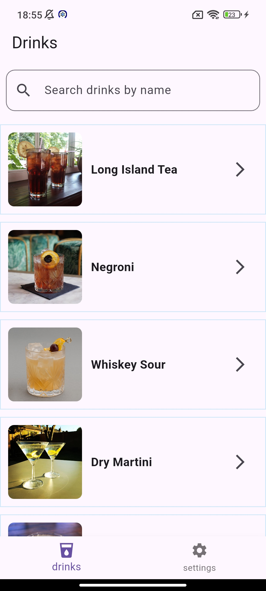
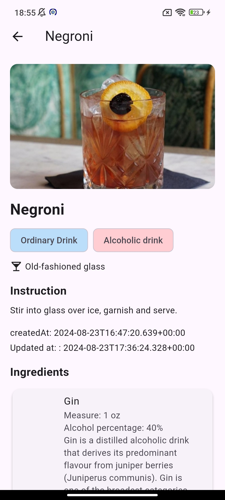
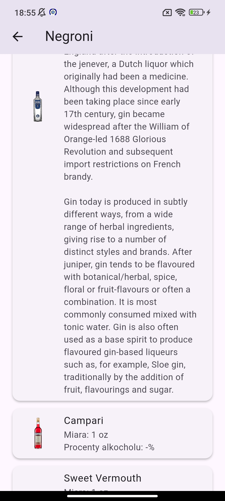
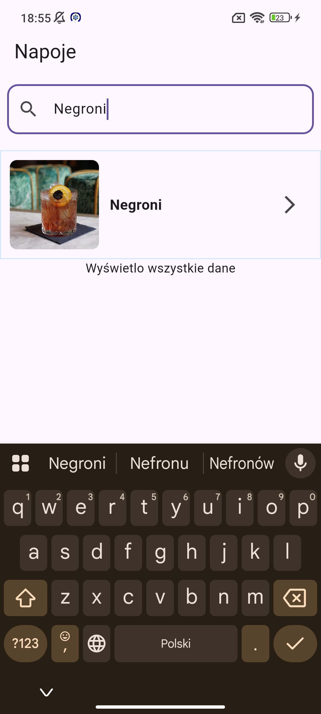

#  Drinks App / Aplikacja Drinks

---

## 🇬🇧 English

### About the App
The **Drinks App** is a **mobile application** located in  
`/src/mobile/drinks`, built using the **Flutter framework**.

The application allows users to explore various drinks via a public Drinks API.  
It includes the following features:

- **Drink list** – dynamically loaded from the Drinks API  
  
- **Drink details** – displaying name, image, and preparation method  
  
- **Ingredients list** – shows all ingredients used for each drink  
  
- **Language settings panel** – allows switching between supported languages  
  

### Technologies and Packages
- `flutter_localizations` – internationalization and localization support  
- `http` – HTTP client for API communication  
- `infinite_scroll_pagination` – efficient pagination for drink lists  
- `get_it` – dependency injection and singleton management  

### How to Run
```bash
cd src/mobile/drinks
flutter pub get
flutter run 
```

# Aplikacja Drinks

## O aplikacji
**Aplikacja Drinks** to **aplikacja mobilna**, znajdująca się w  
`/src/mobile/drinks`, napisana we frameworku **Flutter**.

Aplikacja umożliwia przeglądanie różnych napojów z publicznego API Drinks.  
Zawiera następujące funkcjonalności:

- **Lista napojów** – dynamicznie pobierana z API Drinks  
  (doc/img/pl_drink_list.jpg)
- **Szczegóły napoju** – wyświetla nazwę, obraz oraz sposób przygotowania  
  
-  **Lista składników** – prezentuje wszystkie składniki danego napoju  
  
- **Panel językowy** – umożliwia zmianę języka aplikacji  
  

## Użyte technologie i pakiety
- `flutter_localizations` – obsługa tłumaczeń i lokalizacji  
- `http` – klient HTTP do komunikacji z API  
- `infinite_scroll_pagination` – paginacja listy napojów  
- `get_it` – rejestracja i pobieranie singletonów (dependency injection)

## Jak uruchomić
```bash
cd src/mobile/drinks
flutter pub get
flutter run
```